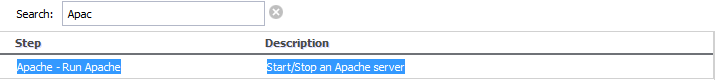
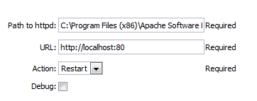
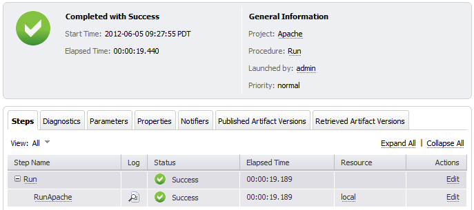
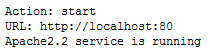
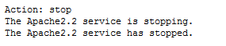

# Apache HTTP Server Project plugin

The Apache HTTP Server Project is a collaborative software development effort aimed at creating a robust, commercial-grade, featureful, and freely-available source code implementation of an HTTP (Web) server. The project is jointly managed by a group of volunteers located around the world, using the Internet and the Web to communicate, plan, and develop the server and its related documentation. The Apache HTTP Server Project is an effort to develop and maintain an open-source HTTP server for modern operating systems including UNIX and Windows NT. The goal of this project is to provide a secure, efficient and extensible server that provides HTTP services in sync with the current HTTP standards.

The EC-Apache plugin lets you interact with the Apache Application Server to accomplish tasks such as managing servers and deployments.

See the Apache [about page](http://httpd.apache.org/ABOUT_APACHE.html).

# Integrated version

This plugin was developed and tested with Apache 3.0.1.

# Plugin procedures

For all parameter descriptions below, required parameters are shown in
bold italics.

In the ElectricFlow UI, go to the Home page, open the Main Menu, and
click **Admin** &gt; **Plugins** to open the Plugin Manager.

## RunApache

With the `RunApache` procedure, you can start, stop, or restart the
Apache server.

<table>
<colgroup>
<col style="width: 50%" />
<col style="width: 50%" />
</colgroup>
<thead>
<tr class="header">
<th style="text-align: left;">Parameter</th>
<th style="text-align: left;">Description</th>
</tr>
</thead>
<tbody>
<tr class="odd">
<td style="text-align: left;">
Path to httpd
</td>
<td style="text-align: left;">
Path to the httpd utility. For example:
C:\Program Files (x86)\Apache Software Foundation\Apache2.2\bin
</td>
</tr>
<tr class="even">
<td style="text-align: left;">
URL
</td>
<td style="text-align: left;">
URL used by Apache to check the status
of the server after you run a command to start, stop, or restart the
Apache HTTP server. The URL must include the protocol, host, and port.
For example: <a href="http://localhost:80">http://localhost:80</a>
</td>
</tr>
<tr class="odd">
<td style="text-align: left;">
Action
</td>
<td style="text-align: left;">
Action to perform. Available options
are start, stop, or restart.
</td>
</tr>
<tr class="even">
<td style="text-align: left;">
Debug
</td>
<td style="text-align: left;">
Enables debug mode.
</td>
</tr>
</tbody>
</table>

To start the server, select the following highlighted step:

Then, enter the following parameters:

When the job is executed, you should see the following job detail. Note
the output indicating that the job finished successfully:

In the **RunApache** step, click the Log icon to see diagnostic
information. Following is a sample report for a "start" action:

Following is a sample report for a "stop" action:

If the action is "restart," the plugin stops the server and then starts
it again.

# Release notes

## EC-Apache 1.0.4

-   The documentation has been migrated to the main documentation site.

## EC-Apache 1.0.3

-   The plugin icon has been updated.

## EC-Apache 1.0.2

-   Renamed ElectricCommander to ElectricFlow.

## EC-Apache 1.0.1

-   Made minor fixes.
